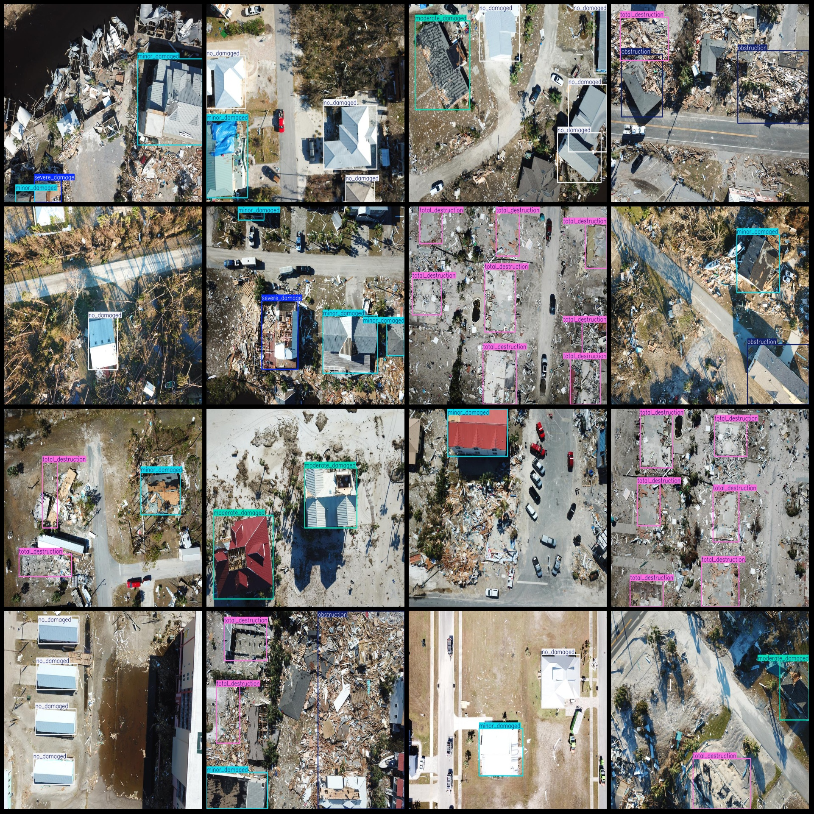
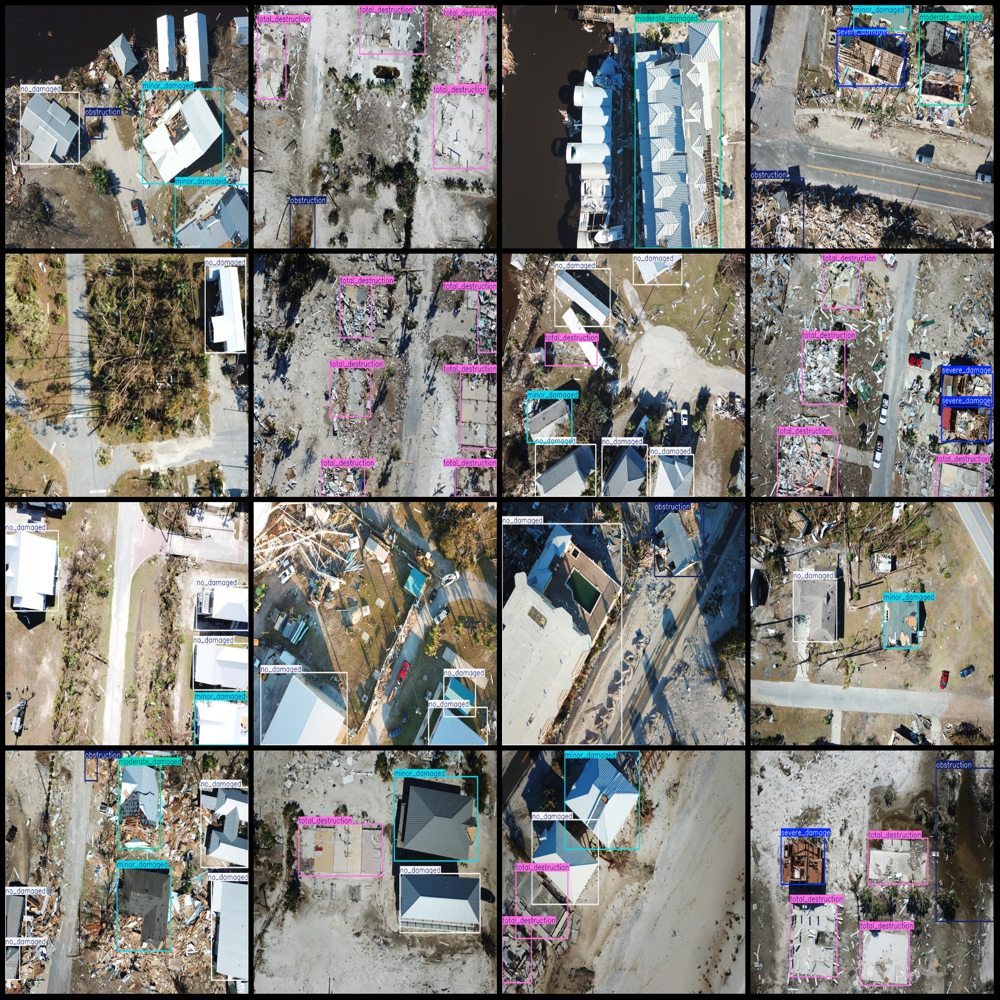

# Drone Perspective Building Damage Detection Dataset (VOC+YOLO) - 865 Images, 6 Classes

Dataset format: Pascal VOC format + YOLO format (txt file without split path, only containing jpg images and corresponding VOC format xml files and yolo format txt files).
Number of images (jpg file count): 865
Number of annotations (xml file count): 865
Number of annotations (txt file count): 865
Number of categories: 6
Annotation category names (note that the order of categories in the yolo format does not correspond to this, but refer to the labels folder's classes.txt for reference): ["minor_damaged", 
"moderate_damaged", "no_damaged", "obstruction", "severe_damage", "total_destruction"]
Number of bounding boxes per category:
- Minor Damaged (Minor Damage): 661, occupied by 425 images
- Moderate Damaged (Moderate Damage): 266, occupied by 227 images
- No Damaged (No Damage): 874, occupied by 422 images
- Obstruction (Obstruction): 342, occupied by 236 images
- Severe Damage (Severe Damage): 184, occupied by 158 images
- Total Destruction (Total Destruction): 986, occupied by 300 images
Total bounding box count: 3313
Image resolution: 800x600
Annotation tool used: labelImg
Annotation rules: draw bounding boxes for each category
Important note: The dataset does not have a separate training validation test split; you will need to do so yourself.
Special declaration: This dataset does not guarantee any accuracy for the trained models or weight files.
Image preview:
Annotation example:
## Image

Here is a pay link on Stripe ( https://buy.stripe.com/3cs8yP7sY87d0vu9AB ). Please contact me lonlonago@foxmail.com after funding $89, and I will send you a complete data files , thank you!

